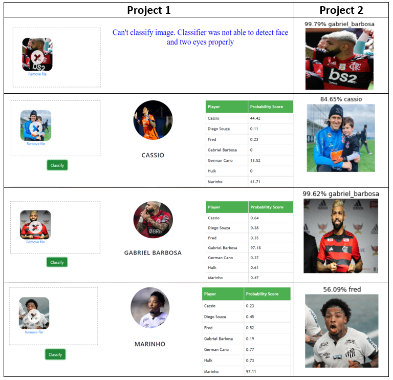

# Soccer Player Classifier

## Project Overview
- Classify 7 brazillian soccer players using 2 different approaches.
1) Cassio (goalkeeper from Corinthians)
2) Diego Souza (forward from Grêmio)
3) Fred (forward from Fluminense)
4) Gabriel Barbosa (forward from Flamengo)
5) German Cano (forward from Vasco)
6) Hulk (forward from Atlético Mineiro)
7) Marinho (forward from Santos)

## Projects:
### Project 1
- Applied Haar cascades for face and eyes detection in order to train our model.
- The best accuracy was from Logistic Regression model after using Grid Search CV defining the models and hypertune parameters.
- Created a web server and a website to make new predictions.

Technologies used in this project,
1. Python
2. Numpy and OpenCV for data cleaning
3. Matplotlib & Seaborn for data visualization
4. Sklearn for model building
5. Jupyter notebook, visual studio code and pycharm as IDE
6. Python flask for http server
7. HTML/CSS/Javascript for UI

The folder Brazillian Soccer Player Classifier using Haar cascades structure is defined as follow:
* UI : This contains the UI website code
* server: Python flask server
* model: Contains python notebook for model building

### Setup:
1. [Download](https://github.com/ThiPauli/Brazilian_Soccer_Player_Classifier/archive/refs/heads/main.zip) the repository
   
2. Install some Dependencies (if necessary)
    ```
    pip install opencv-python, PyWavelets, requests
    ```
3. Run the code [server](https://github.com/ThiPauli/Brazilian_Soccer_Player_Classifier/blob/main/Brazillian%20Soccer%20Player%20Classifier%20using%20Haar%20cascades/server/server.py) from Brazillian Soccer Player Classifier using Haar cascades folder to launch the web server.
    ```
    python server.py
    ```
4. Open the [website](https://github.com/ThiPauli/Brazilian_Soccer_Player_Classifier/blob/main/Brazillian%20Soccer%20Player%20Classifier%20using%20Haar%20cascades/UI/app.html) in a web browser.
5. Drag and drop images to make new predictions.


The seed idea for this project part was taken from ***codebasics*** channel from youtube, which I give the credits.

### Project 2
- Using Tensorflow and Keras to create a Convolutional Neural Network (CNN).
- Using Keras ImageDataGenerator class which allows to perform image augmentation in order to get a better accuracy.
- Projected created with the intuit to highlight some differences of performance in image classification when applying deep learning and machine learning algorithms as in project 1.

## Comparison


## Conclutions:
- The same Dataset used for both projects, but in project 1, it discard images which are not frontal. Therefore, it could not recognize it was Gabriel Barbosa in the example 1.
- Haar cascades tends to be the most effective for frontal images of the face.
- For images which shows more than one face, using Haar cascades might return faces from people who is not relevant. The solution for this case is to delete those images manually when it happends.
- CNN predicted wrongly in the example 4 (Marinho). I presume the lack of training data was the issue.
- Its adivisable to classify using CNN in this case as many images from internet from those soccer players are not frontals.
